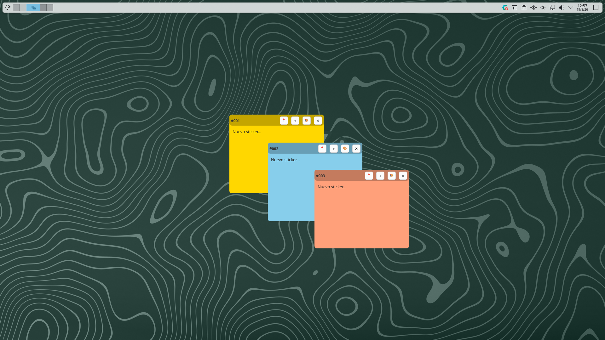
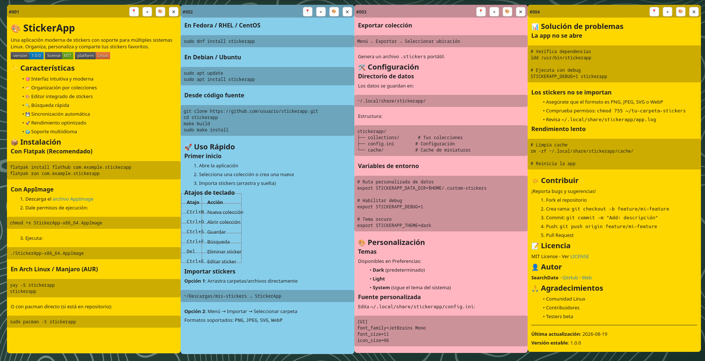

<p align="center">
  
</p>

<h1 align="center">KDE Stickers</h1>

<p align="center">
  <a href="../LICENSE"></a>
  <a href="README-SP.md"></a>
  <a href="README-IT.md"></a>
  <a href="README-EN.md"></a>
  <a href="README-DE.md"></a>
  <a href="README-RU.md"></a>
  <a href="README-CN.md"></a>
  <a href="README-JP.md"></a>
</p>

Frei schwebende Klebezettel für den KDE-Plasma-Desktop. Eigenständige
Qt6/QML-Anwendung (kein Plasmoid), die wie ein normales Programm mit
Autostart installiert wird — jeder Sticker ist ein eigenständiges
Fenster ohne Fensterdekoration, mit dauerhaft gespeicherter Position und
Größe sowie optionaler Sichtbarkeit auf allen virtuellen Arbeitsflächen
je Sticker (Pin).

<p align="center">
  
</p>

## Voraussetzungen

- Plasma 6.x (getestet mit 6.7.4) und KWin, Wayland-Sitzung
- Qt 6.5+ (`Core`, `Gui`, `Qml`, `Quick`, `Widgets`, `DBus`)
- CMake, Bash

## Installation

```bash
chmod +x scripts/install.sh
./scripts/install.sh
```

Kompiliert die Binärdatei, installiert sie nach
`~/.local/bin/kde-stickers` und richtet den Autostart ein. Siehe
[QUICKSTART-DE.md](QUICKSTART-DE.md) für die vollständige Anleitung
(erster Start, Testdaten, Fehlerbehebung) und `QA_CHECKLIST.md` für die
manuelle Prüfliste.

## Funktionen

- Sticker über das Tray-Symbol oder die "+"-Schaltfläche eines
  vorhandenen Stickers erstellen (erscheint gestaffelt, versetzt zum
  Ursprungssticker), mit fortlaufender ID
- Über den Desktop ziehen (echte Bewegung via
  `Window.startSystemMove()`), wobei die tatsächliche Position (von
  KWin gemeldet, nicht von Qt) nach jedem Ziehen gespeichert und beim
  Neustart wiederhergestellt wird, über eine KWin-Fensterregel pro
  Sticker (`kdestickers-sticker-<id>`)
- Größe von der unteren rechten Ecke aus ändern, wobei die Größe wie die
  Position gespeichert und wiederhergestellt wird
- Pin pro Sticker (Schaltfläche 📍/📌): individuell aktivierbar, damit
  dieser Sticker gleichzeitig auf allen virtuellen Arbeitsflächen
  sichtbar ist, über dieselbe KWin-Fensterregel des Stickers; ohne Pin
  existiert der Sticker nur auf der Arbeitsfläche, auf der er erstellt
  oder verschoben wurde. Neue Sticker starten standardmäßig ohne Pin
- Textbearbeitung in **vollständigem Markdown** (Überschriften,
  Tabellen, Code, Zitate, Listen, Fett/Kursiv, Links, Checkboxen), mit
  automatischem Wechsel: Klicken zum Bearbeiten, Fokusverlust für die
  Rückkehr zur gerenderten Vorschau
- In der Vorschau sind Links anklickbar (öffnen über den URL-Handler des
  Systems), und Code-Blöcke werden in einem Kasten mit abgesetztem
  Hintergrund dargestellt
- Scrollbarer Inhalt: eine lange Notiz läuft nie über den Sticker
  hinaus, und der Bearbeitungsbereich scrollt beim Tippen automatisch
  mit, damit der Cursor sichtbar bleibt
- Hintergrundfarbe: feste Palette aus 6 Pastelltönen (zufällig jedem
  neuen Sticker zugewiesen) oder freie Farbauswahl
- Name pro Sticker, bearbeitbar über das Sticker-Panel: falls nicht
  gesetzt, wird er automatisch aus der ersten nicht leeren Zeile des
  Texts abgeleitet (führende `#`-Überschriftenzeichen werden entfernt).
  Auf 30 Zeichen gekürzt, sowohl im Sticker-Kopfbereich
  (`#<id> | <Name oder Ersatzwert>`) als auch im Tray-Menü / Panel
- Das Symbol im Systembereich listet die 10 zuletzt geänderten Notizen
  auf (ohne Seitennummerierung) — jede Zeile öffnet die Notiz oder holt
  sie in den Vordergrund. Das "Sticker-Panel" im selben Menü öffnet ein
  Fenster mit der vollständigen, unbegrenzten Liste: jede Notiz öffnen,
  umbenennen und löschen (mit Bestätigung)
- Die Schaltfläche "✕" eines Stickers schließt nur dessen Fenster — die
  Notiz besteht weiterhin und kann über das Tray-Menü wieder geöffnet
  werden. Das Löschen einer Notiz ist eine eigene Aktion, die nur über
  das Sticker-Panel erreichbar ist und stets eine Bestätigung verlangt;
  dabei wird auch die zugehörige KWin-Fensterregel entfernt
- Persistenz in `~/.stickers/stickers.json`
- Einzelinstanz: Läuft die App bereits, öffnet ein erneuter Start keine
  doppelte Kopie
- Automatische Wiederherstellung, falls KWin während der Sitzung neu
  startet (Absturz oder `kwin_wayland --replace`): die
  Positions-Persistenz verbindet sich von selbst neu, ohne dass die App
  neu gestartet werden muss
- Das Installationsskript entfernt verwaiste KWin-Regeln, die von in
  früheren Sitzungen gelöschten Stickern übrig geblieben sind
- Autostart über einen Standard-freedesktop-`.desktop`-Eintrag (nicht
  über Plasmas "Hintergrunddienste")

<p align="center">
  
</p>

## Speicherung

Die Sticker werden in `~/.stickers/stickers.json` gespeichert:

```json
{
  "stickers": [
    {
      "id": "001",
      "name": "",
      "text": "Contenido en Markdown",
      "color": "#FFD700",
      "x": 100,
      "y": 200,
      "width": 300,
      "height": 250,
      "pinned": false,
      "created": "2026-08-17T10:30:00Z",
      "modified": "2026-08-17T15:45:00Z"
    }
  ]
}
```

## Lizenz

GPL-3.0
