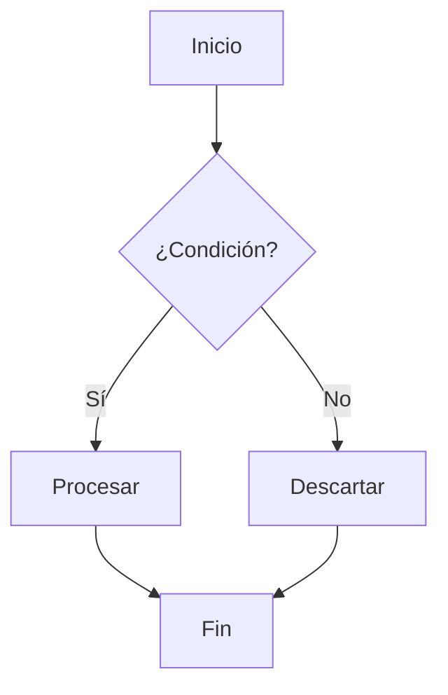
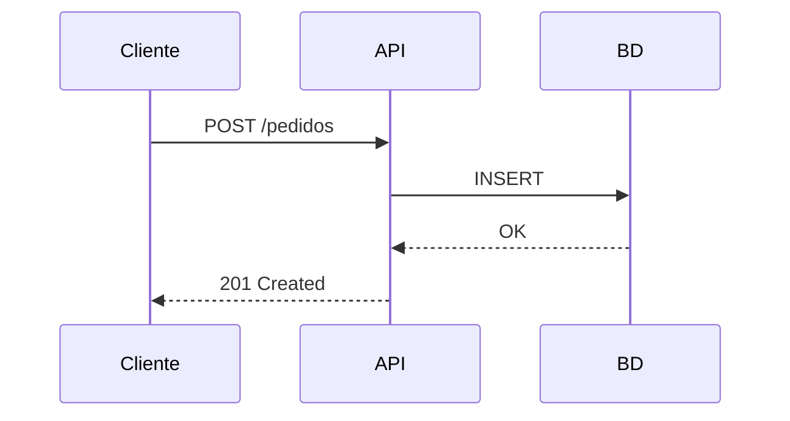
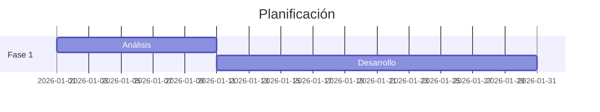

# Ejemplo completo de Markdown

Archivo de demostración con todas las combinaciones habituales de sintaxis Markdown (CommonMark + GitHub Flavored Markdown + extensiones comunes).

---

## 1. Encabezados

# H1 — Encabezado nivel 1
## H2 — Encabezado nivel 2
### H3 — Encabezado nivel 3
#### H4 — Encabezado nivel 4
##### H5 — Encabezado nivel 5
###### H6 — Encabezado nivel 6

Encabezado H1 alternativo (Setext)
===================================

Encabezado H2 alternativo (Setext)
-----------------------------------

---

## 2. Énfasis y combinaciones

| Resultado | Sintaxis |
|---|---|
| *cursiva* | `*cursiva*` o `_cursiva_` |
| **negrita** | `**negrita**` o `__negrita__` |
| ***negrita y cursiva*** | `***texto***` |
| ~~tachado~~ | `~~tachado~~` |
| `código en línea` | `` `código` `` |
| ***~~negrita cursiva tachada~~*** | `***~~texto~~***` |
| **negrita con `código` dentro** | `**negrita con \`código\`**` |
| *cursiva con [enlace](https://example.com) dentro* | `*cursiva con [enlace](url)*` |
| <sub>subíndice</sub> y <sup>superíndice</sup> | `<sub>` y `<sup>` (HTML) |
| <mark>resaltado</mark> | `<mark>` (HTML) |
| <u>subrayado</u> | `<u>` (HTML) |

Texto normal con **negrita al inicio**, luego *cursiva*, después ***ambas***, un ~~error corregido~~ y finalmente `código`.

---

## 3. Párrafos y saltos de línea

Este es un párrafo normal. El texto continúa en la misma línea aunque
lo escribas en varias líneas del fichero fuente.

Esta línea termina con dos espacios  
y produce un salto de línea suave.

Esta línea usa una etiqueta HTML<br>
para el salto de línea.

---

## 4. Listas

### 4.1 No ordenadas

- Elemento con guión
* Elemento con asterisco
+ Elemento con signo más

### 4.2 Ordenadas

1. Primer elemento
2. Segundo elemento
3. Tercer elemento

Numeración automática (todos con `1.`):

1. Primero
1. Segundo
1. Tercero

Empezando en otro número:

5. Cinco
6. Seis
7. Siete

### 4.3 Anidadas y mixtas

- Nivel 1
  - Nivel 2
    - Nivel 3
      - Nivel 4
- Nivel 1 otra vez
  1. Ordenada dentro de no ordenada
  2. Segundo
     - No ordenada dentro de ordenada
       ```bash
       echo "bloque de código dentro de una lista"
       ```
     - Con **formato** y `código`

### 4.4 Listas de tareas (GFM)

- [x] Tarea completada
- [ ] Tarea pendiente
- [ ] Tarea con **formato** y [enlace](https://example.com)
  - [x] Subtarea completada
  - [ ] Subtarea pendiente

### 4.5 Listas de definición (extensión)

Término 1
: Definición del primer término.

Término 2
: Primera definición.
: Segunda definición.

### 4.6 Lista con párrafos

1. Primer elemento con varios párrafos.

   Este segundo párrafo pertenece al elemento 1 (indentado 3 espacios).

2. Segundo elemento.

   > Una cita dentro de un elemento de lista.

---

## 5. Citas (blockquotes)

> Cita simple de una línea.

> Cita de varias líneas
> que continúa aquí
> y termina aquí.

> ### Cita con encabezado
>
> Con **negrita**, `código` y una lista:
>
> - Punto uno
> - Punto dos
>
> ```python
> print("código dentro de una cita")
> ```

> Cita nivel 1
> > Cita nivel 2 anidada
> > > Cita nivel 3 anidada

### Avisos / callouts (estilo GitHub)

> [!NOTE]
> Información útil que el lector debería conocer.

> [!TIP]
> Consejo para hacer las cosas mejor.

> [!IMPORTANT]
> Información clave para conseguir el objetivo.

> [!WARNING]
> Contenido urgente que requiere atención inmediata.

> [!CAUTION]
> Posibles consecuencias negativas de una acción.

---

## 6. Código

### 6.1 En línea

Usa `npm install` para instalar. Para mostrar backticks: ``código con ` dentro``.

### 6.2 Bloque indentado (4 espacios)

    function saludo() {
      return "Hola";
    }

### 6.3 Bloques delimitados con resaltado de sintaxis

```java
package com.searchdate.demo;

import org.springframework.boot.SpringApplication;
import org.springframework.boot.autoconfigure.SpringBootApplication;

@SpringBootApplication
public class DemoApplication {
    public static void main(String[] args) {
        SpringApplication.run(DemoApplication.class, args);
    }
}
```

```python
def fibonacci(n: int) -> list[int]:
    seq = [0, 1]
    while len(seq) < n:
        seq.append(seq[-1] + seq[-2])
    return seq[:n]
```

```javascript
const suma = (a, b) => a + b;
console.log(suma(2, 3)); // 5
```

```sql
SELECT cliente_id, COUNT(*) AS pedidos
FROM pedidos
WHERE fecha >= '2026-01-01'
GROUP BY cliente_id
ORDER BY pedidos DESC;
```

```bash
#!/usr/bin/env bash
set -euo pipefail
docker compose up -d --build
```

```yaml
version: "3.9"
services:
  api:
    image: searchdate/api:latest
    ports:
      - "8080:8080"
    environment:
      SPRING_PROFILES_ACTIVE: prod
```

```json
{
  "nombre": "ejemplo",
  "activo": true,
  "tags": ["markdown", "demo"],
  "version": 1.0
}
```

```diff
- const version = "1.0.0";
+ const version = "2.0.0";
  const nombre = "demo";
```

```
Bloque sin lenguaje especificado:
texto plano, sin resaltado.
```

Bloque anidado (usando cuatro backticks):

````markdown
```python
print("un bloque dentro de otro")
```
````

---

## 7. Tablas

### 7.1 Tabla básica

| Columna A | Columna B | Columna C |
|-----------|-----------|-----------|
| Valor 1   | Valor 2   | Valor 3   |
| Valor 4   | Valor 5   | Valor 6   |

### 7.2 Alineación

| Izquierda | Centrado | Derecha |
|:----------|:--------:|--------:|
| abc       |   abc    |     abc |
| 1         |    22    |     333 |
| texto largo | medio  |       1 |

### 7.3 Con formato dentro

| Elemento | Estado | Notas |
|---|:---:|---|
| **Kafka** | ✅ | Broker `3.7`, ver [docs](https://kafka.apache.org) |
| *ClickHouse* | ⚠️ | Falta ~~tuning~~ ajuste de índices |
| `Terraform` | ❌ | Pendiente de<br>migración |
| Pipe escapado | ✅ | Se escribe con `\|` |

### 7.4 Tabla mínima

Clave | Valor
--- | ---
a | 1
b | 2

---

## 8. Enlaces

- Enlace en línea: [SearchDate](https://example.com)
- Con título: [Ejemplo](https://example.com "Título al pasar el ratón")
- Automático: <https://example.com>
- Correo: <hola@example.com>
- Por referencia: [enlace de referencia][ref1]
- Referencia implícita: [ref2][]
- Relativo: [otro documento](./docs/otro.md)
- Ancla interna: [ir a la sección de tablas](#7-tablas)
- Enlace con **formato** dentro: [texto **en negrita**](https://example.com)

[ref1]: https://example.com/pagina "Título opcional"
[ref2]: https://example.com/otra

---

## 9. Imágenes

Imagen en línea:


Imagen por referencia:

![Logo][logo-ref]

[logo-ref]: https://via.placeholder.com/120.png "Logo"

Imagen como enlace:

[](https://example.com)

Imagen con tamaño controlado (HTML):


---

## 10. Separadores horizontales

Tres formas equivalentes:

---

***

___

---

## 11. Notas al pie

Esto es una afirmación con nota al pie[^1] y otra más[^nota].

[^1]: Contenido de la primera nota al pie.
[^nota]: Nota con identificador textual, **formato** y varias líneas.
    La continuación va indentada cuatro espacios.

---

## 12. HTML embebido

<details>
<summary>Sección desplegable (haz clic para expandir)</summary>

Contenido oculto por defecto. Admite Markdown:

- Lista dentro del desplegable
- Con `código`

```bash
echo "también bloques de código"
```

</details>

<div align="center">
  <strong>Bloque HTML centrado</strong><br>
  <em>con varias líneas</em>
</div>

<table>
  <tr><th>HTML</th><th>Tabla</th></tr>
  <tr><td>Fila 1</td><td>Valor</td></tr>
</table>

<kbd>Ctrl</kbd> + <kbd>C</kbd> para copiar.

<!-- Este es un comentario y no se renderiza -->

---

## 13. Caracteres escapados

Se escapan con barra invertida: \* \_ \` \# \[ \] \( \) \{ \} \+ \- \. \! \| \\ \< \>

Ejemplo: \*esto no es cursiva\* y \# esto no es un encabezado.

Entidades HTML: &copy; &amp; &lt; &gt; &nbsp; &mdash; &hellip; &rarr; &euro;

---

## 14. Matemáticas (LaTeX / KaTeX)

Fórmula en línea: $E = mc^2$ y también $\sum_{i=1}^{n} i = \frac{n(n+1)}{2}$.

Fórmula en bloque:

$$
\int_{0}^{\infty} e^{-x^2}\,dx = \frac{\sqrt{\pi}}{2}
$$

$$
\begin{bmatrix}
a & b \\
c & d
\end{bmatrix}
\cdot
\begin{bmatrix}
x \\
y
\end{bmatrix}
=
\begin{bmatrix}
ax + by \\
cx + dy
\end{bmatrix}
$$

---

## 15. Diagramas Mermaid







---

## 16. Emoji

Códigos cortos: :rocket: :white_check_mark: :warning: :bug: :tada:

Unicode directo: 🚀 ✅ ⚠️ 🐛 🎉 📦 🔧

---

## 17. Metadatos YAML (front matter)

Se colocan **al principio del archivo**, delimitados por `---`:

```yaml
---
title: Mi documento
author: Javi
date: 2026-09-16
tags: [markdown, ejemplo, documentación]
draft: false
---
```

---

## 18. Combinaciones complejas

> [!TIP]
> **Ejemplo combinado:** una cita que contiene una tabla, una lista de tareas y código.
>
> | Paso | Estado |
> |---|:---:|
> | Configurar | ✅ |
> | Desplegar | ⬜ |
>
> - [x] Revisar la [documentación](https://example.com)
> - [ ] Ejecutar `terraform apply`
>
> ```hcl
> resource "docker_container" "api" {
>   name  = "api"
>   image = docker_image.api.image_id
> }
> ```

<details>
<summary><strong>Tabla dentro de un desplegable</strong></summary>

| Servicio | Puerto | Protocolo |
|---|---:|---|
| Traefik | 443 | HTTPS |
| API | 8080 | HTTP |
| Kafka | 9092 | TCP |

</details>

1. **Lista ordenada** con todo dentro:
   > Cita anidada en un elemento de lista.

   | A | B |
   |---|---|
   | 1 | 2 |

   ```json
   { "anidado": true }
   ```

   - [ ] Con subtarea pendiente

---

## 19. Referencia rápida

| Elemento | Sintaxis |
|---|---|
| Encabezado | `# H1` … `###### H6` |
| Negrita | `**texto**` |
| Cursiva | `*texto*` |
| Tachado | `~~texto~~` |
| Código en línea | `` `código` `` |
| Bloque de código | ` ```lenguaje ` … ` ``` ` |
| Enlace | `[texto](url)` |
| Imagen | `` |
| Lista | `- item` / `1. item` |
| Tarea | `- [ ]` / `- [x]` |
| Cita | `> texto` |
| Tabla | `\| a \| b \|` |
| Separador | `---` |
| Nota al pie | `texto[^1]` |
| Salto de línea | dos espacios al final |

---

*Fin del documento de ejemplo.*
